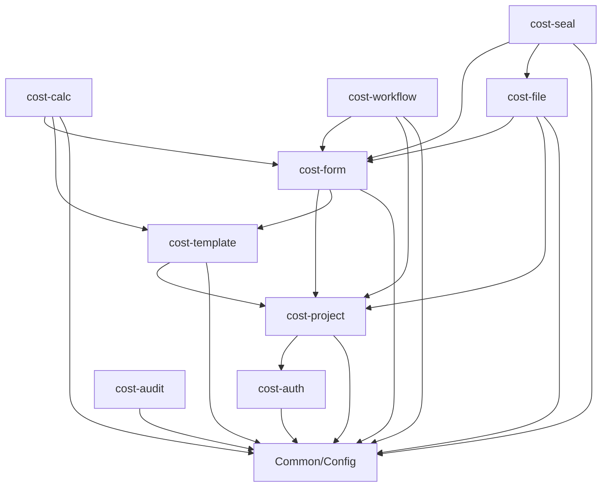

# Design Document: Project Restructure

## Overview

This design outlines the comprehensive restructuring of the Engineering Cost Plan & Tax Control System from a monolithic single-package structure to a modular multi-package architecture. The restructuring will separate frontend and backend code, organize backend functionality into 9 distinct modules, and establish clear boundaries and dependencies while preserving all existing API contracts and database schemas.

The restructuring follows the modular architecture defined in Backend-Design.md and implements the requirements for improved maintainability, clear separation of concerns, and independent development capabilities.

## Architecture

### Current State
```
src/main/java/com/costcontrol/
├── config/
├── controller/
├── dto/
├── entity/
├── repository/
├── security/
├── service/
└── util/
```

### Target State
```
backend/
├── src/main/java/com/costcontrol/
│   ├── CostSystemApplication.java
│   ├── config/                    # Shared configuration
│   ├── common/                    # Shared utilities and base classes
│   └── modules/
│       ├── auth/                  # cost-auth module
│       ├── project/               # cost-project module
│       ├── template/              # cost-template module
│       ├── form/                  # cost-form module
│       ├── calc/                  # cost-calc module
│       ├── workflow/              # cost-workflow module
│       ├── file/                  # cost-file module
│       ├── seal/                  # cost-seal module
│       └── audit/                 # cost-audit module
└── src/test/java/com/costcontrol/
    ├── modules/                   # Module-specific tests
    └── integration/               # Cross-module integration tests

frontend/                          # Separate frontend project
├── src/
├── public/
├── package.json
└── ...
```

### Module Dependency Hierarchy



## Components and Interfaces

### Module Structure Template

Each module follows a consistent internal structure:

```
modules/{module-name}/
├── controller/          # REST controllers
├── service/            # Business logic
├── repository/         # Data access
├── entity/            # JPA entities
├── dto/               # Data transfer objects
│   ├── request/       # Request DTOs
│   └── response/      # Response DTOs
├── config/            # Module-specific configuration
└── exception/         # Module-specific exceptions
```

### Core Modules Definition

#### 1. cost-auth Module
**Responsibility:** Authentication, JWT token management, system-level role and permission management

**Components:**
- `AuthController` - Login, logout, token refresh endpoints
- `AuthService` - Authentication business logic
- `JwtUtil` - JWT token operations
- `User` entity and related DTOs
- `UserRepository`
- Security filters and configurations

**Key Interfaces:**
```java
public interface AuthService {
    LoginResponse login(LoginRequest request);
    void logout(String token);
    LoginResponse refreshToken(RefreshTokenRequest request);
    UserInfo getCurrentUser();
}
```

#### 2. cost-project Module
**Responsibility:** Project management, project membership, project-level permissions

**Components:**
- `ProjectController` - Project CRUD and member management
- `ProjectService` - Project business logic
- `Project`, `ProjectMember` entities
- Project-related DTOs and repositories
- `ProjectAccessInterceptor` - Project isolation enforcement

**Key Interfaces:**
```java
public interface ProjectService {
    ProjectResponse createProject(ProjectCreateRequest request);
    List<ProjectResponse> getUserProjects();
    UserPermissionsResponse getUserPermissions(Long projectId);
    void addMember(Long projectId, ProjectMemberRequest request);
}
```

#### 3. cost-template Module
**Responsibility:** Template schema management, data dictionaries, calculation rules

**Components:**
- `TemplateController` - Template management endpoints
- `TemplateService` - Template business logic
- `Template`, `DictionaryCategory`, `CalcRule` entities
- Template-related DTOs and repositories

#### 4. cost-form Module
**Responsibility:** Form versions, line items CRUD, data validation

**Components:**
- `VersionController` - Version lifecycle management
- `LineItemController` - Line item operations
- `VersionService`, `LineItemService`
- `FormVersion`, `LineItem` entities
- Form-related DTOs and repositories

#### 5. cost-calc Module
**Responsibility:** Calculation engine, indicator computation, calculation tracing

**Components:**
- `CalcController` - Calculation trigger endpoints
- `CalcEngine` - DSL expression evaluation
- `IndicatorService` - Indicator management
- `IndicatorValue` entity
- Calculation-related DTOs

#### 6. cost-workflow Module
**Responsibility:** Approval workflows, task management (Flowable integration)

**Components:**
- `WorkflowController` - Task and approval endpoints
- `WorkflowService` - Flowable integration
- Workflow-related DTOs

#### 7. cost-file Module
**Responsibility:** File upload/download, import/export operations

**Components:**
- `FileController` - File operation endpoints
- `ImportExportService` - Excel processing
- `FileService` - File management
- `FileObject` entity

#### 8. cost-seal Module
**Responsibility:** Document sealing, PDF generation, hash verification

**Components:**
- `SealController` - Sealing endpoints
- `SealService` - PDF sealing logic
- `SealRecord` entity

#### 9. cost-audit Module
**Responsibility:** Audit logging, change tracking, diff recording

**Components:**
- `AuditService` - Audit log management
- `AuditAspect` - AOP-based audit capture
- `AuditLog` entity

### Shared Components

#### Common Package
```
common/
├── dto/
│   └── ApiResponse.java          # Shared response wrapper
├── exception/
│   ├── GlobalExceptionHandler.java
│   ├── BusinessException.java
│   └── ValidationException.java
├── util/
│   ├── DateUtil.java
│   └── ValidationUtil.java
└── annotation/
    ├── RequirePerm.java          # Permission annotation
    └── AuditLog.java             # Audit annotation
```

#### Config Package
```
config/
├── SecurityConfig.java           # Global security configuration
├── DatabaseConfig.java          # Database configuration
├── RedisConfig.java             # Redis configuration
└── SwaggerConfig.java           # API documentation
```

## Data Models

### Entity Migration Mapping

| Current Location | Target Module | Entity Classes |
|------------------|---------------|----------------|
| `entity/User.java` | cost-auth | User |
| `entity/Project.java` | cost-project | Project |
| `entity/ProjectMember.java` | cost-project | ProjectMember |
| `entity/FormVersion.java` | cost-form | FormVersion |
| New entities | cost-template | Template, DictionaryCategory, CalcRule |
| New entities | cost-form | LineItem |
| New entities | cost-calc | IndicatorValue |
| New entities | cost-file | FileObject |
| New entities | cost-seal | SealRecord |
| New entities | cost-audit | AuditLog |

### Cross-Module Entity Access

Modules access entities from other modules through service interfaces, not direct repository access:

```java
// In cost-form module
@Service
public class VersionService {
    @Autowired
    private ProjectService projectService; // From cost-project module
    
    public VersionResponse createVersion(Long projectId, VersionCreateRequest request) {
        // Validate project access through service interface
        projectService.validateProjectAccess(projectId);
        // ... version creation logic
    }
}
```

## Migration Strategy

### Phase 1: Project Structure Setup
1. Create `backend/` directory
2. Move existing `src/` to `backend/src/`
3. Create module package structure
4. Set up shared `common/` and `config/` packages

### Phase 2: Module-by-Module Migration

**Migration Order (based on dependency hierarchy):**

1. **cost-auth** (foundational, no dependencies)
   - Move: `AuthController`, `AuthService`, `User` entity
   - Move: `JwtUtil`, security classes
   - Update: Package imports and references

2. **cost-project** (depends on cost-auth)
   - Move: `ProjectController`, `ProjectService`
   - Move: `Project`, `ProjectMember` entities
   - Create: `ProjectAccessInterceptor`

3. **cost-template** (depends on cost-project)
   - Create: New template-related classes
   - Implement: Template management functionality

4. **cost-form** (depends on cost-project, cost-template)
   - Move: `VersionController`, `VersionService`
   - Move: `FormVersion` entity
   - Create: `LineItem` entity and related classes

5. **cost-calc** (depends on cost-form, cost-template)
   - Create: Calculation engine components
   - Implement: DSL evaluation logic

6. **cost-workflow** (depends on cost-form, cost-project)
   - Create: Workflow integration components

7. **cost-file** (depends on cost-form, cost-project)
   - Create: File management components

8. **cost-seal** (depends on cost-form, cost-file)
   - Create: Sealing components

9. **cost-audit** (cross-cutting, minimal dependencies)
   - Create: Audit logging components

### Phase 3: Frontend Separation
1. Create `frontend/` directory structure
2. Extract frontend assets and dependencies
3. Set up separate frontend build process
4. Configure API communication

### Phase 4: Integration and Testing
1. Update all import statements
2. Verify API contract preservation
3. Run comprehensive test suite
4. Performance validation

## Error Handling

### Module-Specific Exceptions

Each module defines its own exception hierarchy:

```java
// In cost-project module
public class ProjectNotFoundException extends BusinessException {
    public ProjectNotFoundException(Long projectId) {
        super("PROJECT_NOT_FOUND", "Project not found: " + projectId);
    }
}

// In cost-form module  
public class VersionStateException extends BusinessException {
    public VersionStateException(String message) {
        super("INVALID_VERSION_STATE", message);
    }
}
```

### Global Exception Handling

The `GlobalExceptionHandler` in the common package handles all module exceptions:

```java
@RestControllerAdvice
public class GlobalExceptionHandler {
    
    @ExceptionHandler(BusinessException.class)
    public ResponseEntity<ApiResponse<Void>> handleBusinessException(BusinessException e) {
        return ResponseEntity.badRequest()
            .body(ApiResponse.error(e.getCode(), e.getMessage()));
    }
    
    @ExceptionHandler(AccessDeniedException.class)
    public ResponseEntity<ApiResponse<Void>> handleAccessDenied(AccessDeniedException e) {
        return ResponseEntity.status(403)
            .body(ApiResponse.error("ACCESS_DENIED", "Access denied"));
    }
}
```

## Testing Strategy

### Test Structure Alignment

Tests are organized to mirror the module structure:

```
src/test/java/com/costcontrol/
├── modules/
│   ├── auth/
│   │   ├── controller/AuthControllerTest.java
│   │   ├── service/AuthServiceTest.java
│   │   └── integration/AuthIntegrationTest.java
│   ├── project/
│   │   ├── controller/ProjectControllerTest.java
│   │   ├── service/ProjectServiceTest.java
│   │   └── integration/ProjectIntegrationTest.java
│   └── ... (other modules)
├── integration/
│   ├── CrossModuleIntegrationTest.java
│   └── ApiContractTest.java
└── acceptance/
    ├── ProjectAcceptanceTest.java
    └── VersionStateMachineTest.java
```

### Testing Approach

**Unit Tests:** Test individual components within each module
- Service layer business logic
- Controller request/response handling
- Utility functions

**Integration Tests:** Test module interactions
- Cross-module service calls
- Database operations
- Security enforcement

**Acceptance Tests:** Test end-to-end scenarios
- Complete business workflows
- API contract compliance
- State machine behavior

### Test Migration Strategy

1. **Preserve Existing Tests:** All current tests must continue to pass
2. **Reorganize by Module:** Move tests to appropriate module packages
3. **Add Integration Tests:** Create tests for new module boundaries
4. **Validate API Contracts:** Ensure all endpoints work identically

The dual testing approach combines:
- **Unit tests:** Specific examples, edge cases, error conditions within modules
- **Property tests:** Universal properties across module interactions (where applicable)

Both approaches are complementary and necessary for comprehensive coverage during the restructuring process.

## Correctness Properties

*A property is a characteristic or behavior that should hold true across all valid executions of a system—essentially, a formal statement about what the system should do. Properties serve as the bridge between human-readable specifications and machine-verifiable correctness guarantees.*

### Property 1: Module Organization Compliance
*For any* module in the Backend_System, it should be located under com.costcontrol.modules with the correct internal layer structure (controller, service, entity, dto, repository packages) and contain only functionality appropriate to its domain
**Validates: Requirements 1.2, 1.3, 1.4, 1.5**

### Property 2: Frontend-Backend Separation
*For any* build artifact or dependency, the backend build should contain no frontend assets and the frontend should communicate only through REST API endpoints
**Validates: Requirements 2.3, 2.4, 2.5**

### Property 3: API Contract Preservation
*For any* existing REST endpoint, after restructuring it should maintain identical URL, request/response structure, HTTP status codes, and authentication behavior as the original implementation
**Validates: Requirements 3.1, 3.2, 3.3, 3.4, 3.5**

### Property 4: Database Schema Preservation
*For any* database entity or operation, the restructured system should use identical schema, relationships, constraints, indexes, and access patterns as the original implementation
**Validates: Requirements 4.1, 4.2, 4.3, 4.4, 4.5**

### Property 5: Module Dependency Integrity
*For any* inter-module interaction, it should follow the defined dependency hierarchy, use only service interfaces (not direct repository access), and the overall dependency graph should contain no circular dependencies
**Validates: Requirements 5.1, 5.2, 5.3, 5.4, 5.5**

### Property 6: Migration System Continuity
*For any* migration step, the system should remain functional and all existing functionality should continue to work without degradation
**Validates: Requirements 6.3**

### Property 7: Test Structure Alignment
*For any* test class, it should be located in the appropriate module test package, maintain existing coverage levels, and preserve all integration and acceptance tests
**Validates: Requirements 7.1, 7.2, 7.3, 7.4, 7.5**

### Property 8: Configuration Management Consistency
*For any* configuration setting, it should be centrally managed while allowing module-specific overrides, preserve environment-specific settings, and maintain identical deployment and startup processes
**Validates: Requirements 8.1, 8.2, 8.3, 8.4, 8.5**