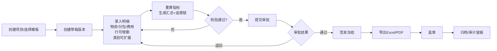

# PRD｜工程成本计划与税务计控系统（一期全量）

## 1. 背景与现状
客户目前使用 Excel 工作簿维护“成本计划单”，包含多 Sheet（物资/分包/费用明细/毛利率/税等），通过公式引用进行汇总后打印、审批、盖章。存在问题：
- Excel 行增删、材料增减会破坏公式引用，维护成本高且易出错
- 多项目文件散落，版本不可控，难审计追溯
- 审批、盖章线下进行，效率低、无法留痕
- 口径（税率/分母/ROUND）难统一，数据可信度不足
- 难以沉淀模板，难以支持不同项目隔离与复用

## 2. 目标与原则
### 2.1 产品目标（一期必须达成）
1. 支持 PC/平板/手机适配，提升填报效率
2. 支持材料类别可增减、明细行可无限扩展
3. 以项目为单位强隔离：权限、数据、文件、审批独立
4. 自动计算生成汇总指标（只读），确保口径统一、结果可追溯
5. 支持在线审批、签发冻结、电子签章、归档
6. 支持 Excel 导入、Excel/PDF 导出（保持客户习惯版式）
7. 提供审计日志（字段级变更、审批操作、导出下载、盖章）

### 2.2 核心原则（防返工）
- 不以“Excel 单元格”建模；以“业务事实数据 + 指标Key + 规则引擎”建模
- 事实数据可编辑；汇总指标只读；规则可配置
- 版本冻结：任何金额修改只能发生在 Draft

## 3. 术语与核心概念
### 3.1 三层模型（核心）
- 事实数据层：材料/分包/费用明细行（可增删改）
- 规则层：计算口径（税率、分母、ROUND、汇总规则）
- 指标层：汇总结果（设备费、分包小计、税、毛利率、总计等），只读

### 3.2 项目隔离
- 所有业务对象必须有 project_id
- 用户必须是项目成员才能访问项目/版本/文件
- 导出文件、盖章文件、附件下载同样按项目权限校验

### 3.3 版本与状态机
- Draft：草稿，可编辑明细、可重算
- InApproval：审批中，不可编辑（可选允许附件）
- Approved：审批通过待签发，不可编辑
- Issued：签发冻结，不可编辑，可导出、可盖章
- Archived：归档只读

强约束：任何明细写操作（新增/更新/删除/导入）仅允许 Draft。

## 4. 角色与权限（RBAC + 动作级）
### 4.1 系统级角色
- SYSTEM_ADMIN：模板/字典/流程全局配置
- SECURITY_ADMIN：账号、权限、角色管理

### 4.2 项目级角色
- PROJECT_ADMIN：项目配置、成员管理
- EDITOR：填报草稿、提交审批
- REVIEWER：复核（可编辑/可退回，可提交视制度配置）
- APPROVER：审批（同意/退回）
- SEAL_ADMIN：签发/盖章
- VIEWER：只读

### 4.3 动作权限（permission）
- 版本：VERSION_CREATE / VERSION_EDIT / VERSION_SUBMIT / VERSION_WITHDRAW / VERSION_ISSUE / VERSION_ARCHIVE
- 明细：ITEM_READ / ITEM_WRITE / ITEM_DELETE / ITEM_IMPORT / ITEM_EXPORT
- 指标：INDICATOR_READ / TRACE_READ
- 审批：TASK_APPROVE / TASK_REJECT / TASK_TRANSFER
- 文件：FILE_DOWNLOAD
- 签章：SEAL_EXECUTE

## 5. 功能范围（一期开全）
### 5.1 登录与安全
- 账号密码登录（必做），可预留 SSO
- JWT access + refresh，支持禁用/改密后旧 token 立即失效
- 登录失败次数限制、验证码、防爆破

### 5.2 项目管理
- 创建项目、查看项目、归档项目
- 项目成员管理与角色分配（项目级权限）
- 项目内数据强隔离（含文件与导出）

### 5.3 成本计划（版本中心）
- 创建草稿版本（支持从上一版本复制明细）
- 版本状态流转：Draft → InApproval → Approved → Issued → Archived
- 版本冻结：Issued 后禁止任何写操作

### 5.4 明细模块（可扩展）
统一使用“明细行”模型，不同模块用 module_code/category_code 区分：
- 物资明细：设备/装材/土建/自定义材料类别（可新增类别）
- 分包明细：基础/组塔/架线/依据规则（可新增类型）
- 费用明细：机械/跨越架/青苗等（可新增类型）
能力：
- 行增删改、复制行、排序
- 批量粘贴（从Excel复制多行）
- 校验：必填、范围、税率白名单
- 保存后触发重算

### 5.5 指标看板（汇总只读 + 追溯）
- 指标分组展示：物资/分包/费用/税/毛利/总计
- 点击指标查看追溯链：
  - 触发了哪些规则
  - 命中了哪些明细行（行ID、名称、金额贡献）
  - 中间值（可选）与最终值

### 5.6 规则引擎（口径统一）
- 规则由模板发布，支持 SUM/ROUND/IF、WHERE过滤、指标引用
- 指标Key 体系稳定，避免因材料新增导致主表崩坏
- 规则变更必须走发布流程并留痕

### 5.7 审批流（在线）
- 支持多级审批、退回、加签/转交（按模板配置）
- 审批通过后可签发冻结

### 5.8 签发与盖章
- 签发：生成 Issued 版本快照（不可变）
- 盖章：在 Issued 版本导出的 PDF 上叠加电子章
- 盖章后生成 sealed PDF，记录 hash 防篡改

### 5.9 导入导出
- 导入 Excel：将Excel数据映射为明细行（可预览差异后确认）
- 导出 Excel：按客户旧表版式导出（对外报送/习惯）
- 导出 PDF：固定版式用于签章/归档
- 下载鉴权：文件下载必须校验项目权限

### 5.10 审计与留痕
- 字段级变更审计：明细行金额/数量/单价/税率等变更必须记录
- 操作审计：登录、提交、审批、签发、导出、下载、盖章全部记录

## 6. 业务流程

## 7. 验收标准（写死，防返工）

- 新增材料类别：仅新增字典配置即可生效（无需改表、无需改主流程代码）
- 新增分包/费用类型：通过模板 schema 配置即可出现
- 规则口径调整：通过 calc_rule 修改 expression + 发布生效，不改代码
- Issued 版本冻结：任何写接口必须拒绝（含导入/批量更新/删除）
- 项目隔离：非成员访问必须 403；导出/下载同样校验
- 导出版式：Excel/PDF 与客户旧表字段与顺序一致
- 审计：金额字段变更可追溯到操作者、时间、版本、差异值
