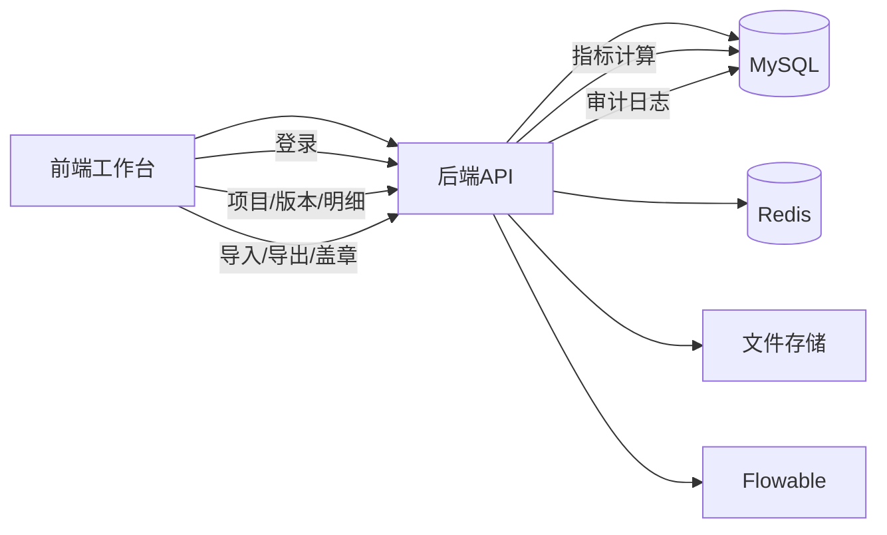

## 工程成本计划与税务计控系统

### 文档信息
- **文档名称**: 系统框架、架构、数据流与功能结构说明
- **版本**: v1.0
- **适用范围**: 一期交付系统（前端 + 后端 + 数据库 + 部署）
- **依据资料**: `docs/prd.md`、`docs/Frontend-UI-Global-Standard.md`、`docs/React前端使用说明.md`、`docs/后端API功能清单.md`、`项目结构说明.md`


---

## 一、系统框架总览（Framework）

### 1.1 系统组成
- **前端系统**: `cost-frontend-react`（React + TypeScript + Vite + Tailwind）
- **后端系统**: `cost-backend`（Spring Boot 3.x + Java 17）
- **数据层**: MySQL 8（结构化数据）+ Redis（缓存/风控/可选黑名单）
- **文件与导出**: Excel/PDF 导入导出、文件对象管理、盖章文件防篡改
- **审批引擎**: Flowable（流程与任务）

### 1.2 框架边界与职责
- **前端**: 负责用户交互、权限与状态的前置控制、调用后端 API、展示结果与追溯。
- **后端**: 负责业务规则、权限/状态强校验、数据处理、审计与流程控制。
- **数据层**: 事实数据（明细）+ 规则（模板）+ 指标（计算结果）。

---

## 二、系统架构（Architecture）

### 2.1 分层架构
- **表现层**: 前端页面与组件（项目、版本工作台、明细、指标、审批、文件、审计）
- **业务层**: 后端模块化服务（Auth/Project/Form/Calc/Workflow/File/Seal/Audit）
- **数据层**: MySQL 持久化数据、文件对象、指标与追溯记录
- **基础设施层**: 安全认证、权限、审计、配置、日志

### 2.2 后端模块划分
- **cost-auth**: 登录、Token、系统角色权限
- **cost-project**: 项目与成员、项目权限
- **cost-template**: 模板、字典、规则
- **cost-form**: 版本、明细行、校验
- **cost-calc**: 指标计算、追溯
- **cost-workflow**: 审批流程与任务
- **cost-file**: 导入导出、文件对象
- **cost-seal**: 签发、盖章、hash 防篡改
- **cost-audit**: 审计日志与 diff

### 2.3 数据模型核心对象
- **项目**: `project`
- **版本**: `form_version`
- **明细行**: `line_item`（模块+类别可扩展）
- **指标与追溯**: `indicator_value`（含 `trace_json`）
- **模板/规则**: `template`、`dictionary_category`、`calc_rule`
- **文件与审计**: `file_object`、`seal_record`、`audit_log`

### 2.4 部署架构（逻辑）
- 前端部署于 Web 服务器或静态资源服务器
- 后端为 Spring Boot 应用
- 前后端通过 `HTTP/JSON` 交互，后端对外仅提供 `REST API`

---

## 三、数据流（Data Flow）

### 3.1 核心业务数据流（概要）
1) **登录认证** → 获取 `accessToken/refreshToken`
2) **项目创建** → 项目成员与权限初始化
3) **版本创建（Draft）** → 版本成为可编辑载体
4) **明细录入/导入** → 保存明细行
5) **规则计算** → 生成指标与追溯
6) **提交审批** → 流程创建/任务分派
7) **审批通过/驳回** → 更新版本状态
8) **签发冻结** → 版本不可写
9) **导出/盖章** → 生成文件对象
10) **归档** → 审计与留痕完成

### 3.2 数据流示意（逻辑图）



### 3.3 关键流程数据流（示例）

#### 3.3.1 明细录入与指标计算
- **输入**: 明细行数据（模块/类别/数量/单价/税率）
- **处理**: 批量保存 → 触发规则计算
- **输出**: 指标结果 + 追溯链（`trace_json`）

#### 3.3.2 审批与状态流转
- **输入**: 版本提交请求
- **处理**: 流程实例 + 任务分派
- **输出**: `IN_APPROVAL` / `APPROVED` / `REJECTED` 等状态变更

#### 3.3.3 导出与盖章
- **输入**: 版本导出请求
- **处理**: Excel/PDF 生成、文件登记、签章、hash 记录
- **输出**: 可下载的文件对象与审计日志

---

## 四、功能结构图（Function Map）

### 4.1 功能结构（树形）

```text
工程成本计划与税务计控系统
├── 认证与安全
│   ├── 登录/登出
│   ├── 令牌管理
│   └── 权限控制
├── 项目管理
│   ├── 项目创建/归档
│   ├── 项目成员管理
│   └── 项目权限
├── 版本管理
│   ├── 版本创建
│   ├── 状态流转
│   └── 冻结控制
├── 明细管理
│   ├── 物资明细
│   ├── 分包明细
│   └── 费用明细
├── 指标计算
│   ├── 规则引擎
│   ├── 指标计算
│   └── 追溯链
├── 审批流程
│   ├── 提交审批
│   ├── 审批通过/驳回
│   └── 任务转交
├── 导入导出
│   ├── Excel导入
│   ├── Excel导出
│   └── PDF导出
├── 签发与盖章
│   ├── 签发冻结
│   └── 盖章与防篡改
└── 审计与日志
    ├── 操作审计
    └── 差异追溯
```

---

## 五、系统关键约束与规则

### 5.1 权限与隔离
- 项目级隔离：**非成员访问一律拒绝**
- 动作级权限：写操作需具备对应 `perm_code`

### 5.2 版本状态机（硬约束）
- `DRAFT` 才可写
- `IN_APPROVAL`/`APPROVED`/`ISSUED` 只读
- `ISSUED` 可导出与盖章

### 5.3 模板与规则可配置
- 模板通过 `schema_json` 控制字段与布局
- 规则使用 DSL 配置，避免改代码

---

## 六、技术栈与运行信息（摘要）

- **前端**: React 18 + TypeScript + Vite + Tailwind
- **后端**: Java 17 + Spring Boot 3.x + Spring Security + JPA
- **数据库**: MySQL 8
- **缓存**: Redis
- **工作流**: Flowable
- **文件处理**: Apache POI / PDF 引擎

---

## 七、结论

本系统采用 **前后端分离 + 后端模块化** 的架构设计，通过“事实数据层 + 规则层 + 指标层”保障成本口径统一，同时以版本状态机、审计日志与流程引擎支撑全流程合规与可追溯。系统框架清晰、模块边界明确、数据流闭环完整，满足客户对成本计划、审批、导出与盖章的核心诉求。
